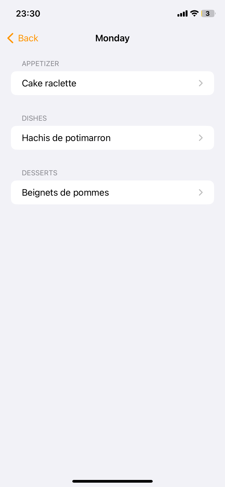
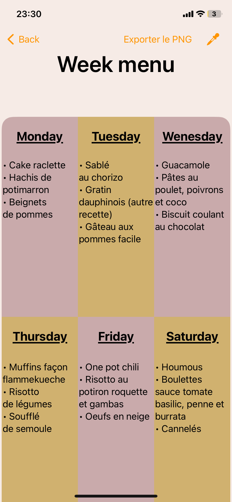

.. _alea:

Page menus aléatoires
======================

Cette fonctionnalité permet de générer un menu pour 6 jours de manière aléatoire. Pour cela, il suffit de sélectionner dans la partie haute quelle catégorie vous souhaitez avoir dans votre menu et une recette appraîtra par jour en dessous. Vous pouvez si vous le souhaitez, modifier le menu généré en cliquant sur le jour que vous voulez modifier. Voir la section :ref:`modifMenu`/.

Les deux boutons en haut à droite permettent d':ref:`exporterpng` ou d'afficher la liste des ingrédients pour les courses.

.. _Aleatoire:
.. figure:: Figures/aleatoire.png
  :width: 300
  :align: center

|

.. _modifMenu:

Modification du menu 
----------------------

Si plusieurs catégories ont été sélectionnées, vous aurez les différentes catégories présentées sur la page suivante. Il suffit ensuite de cliquer sur la catégorie à modifier pour en modifier le contenu. 

Une nouvelle page apparaît alors avec une liste de toutes vos recettes pour la catégorie sélectionnée. Une suffit ensuite de choisir la recette à mettre dans le menu.

 
.. image:: Figures/aleatoirebis.png
  :width: 45%
  :align: right

|

.. _exporterpng:

Exporter le menu en PNG
------------------------

Une fois que vous avez cliqué sur le bouton pour l'export en PNG, vous obtenez cette page décrivant vos menus pour chacun des 6 jours. Vous avez ensuite la possibilité, via les deux boutons en haut à droite, d'enregistrer le rendu directement dans votre gallerie photo ou bien de modifier les différentes couleurs avant de l'enregistrer.

.. _ExportPNG:
