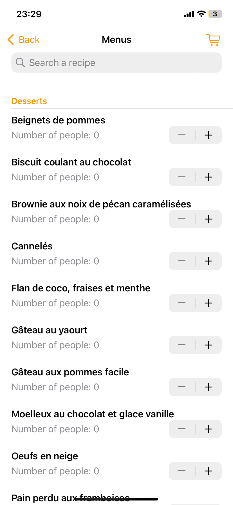
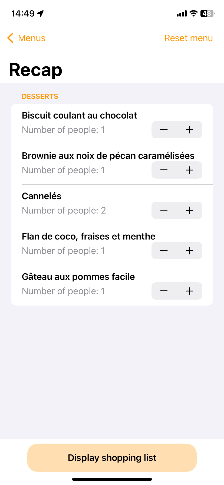

.. _menus:

Page des menus
================

Cette fonction vous permettra de générer vos menus en sélectionnant le nombre de personnes pour chaque recette via les boutons +/-. En cliquant ensuite sur le bouton en haut à droite, vous accéderez au récapitulatif de votre menu avec encore la possibilité de le modifier. A l'aide du bouton en haut à droite, vous pourrez réinitialiser le menu pour tout remettre à zéro. 

Enfin, le bouton en bas permet de générer la liste des courses nécessaire pour cuisiner votre menu. Vous pourrez ensuite partager cette liste par message ou dans vos notes si vous le souhaitez.

   
